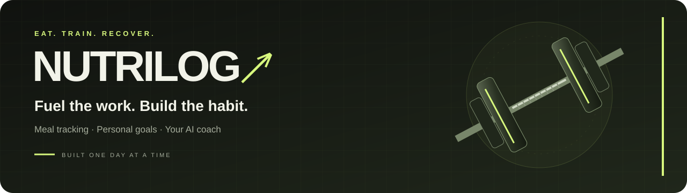
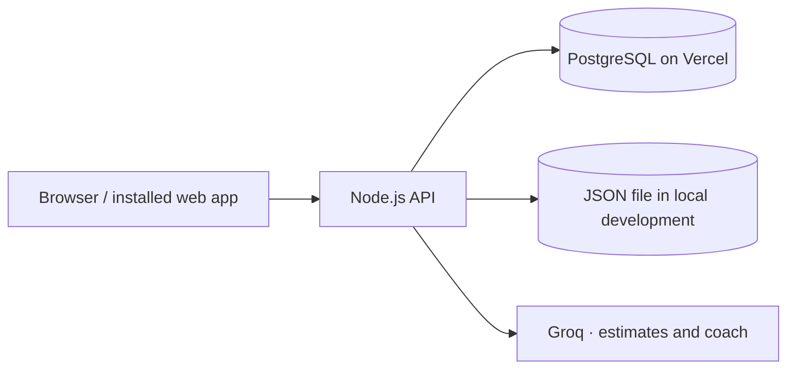

<p align="center">
  
</p>

<p align="center">
  <strong>Your meals. Your goals. A coach in your corner.</strong><br />
  Track your nutrition and build stronger everyday habits, one meal at a time.
</p>

<p align="center">
  <a href="https://nutrilog-diet-ai.vercel.app/">Open NutriLog ↗</a>
  · <a href="#quick-start">Run locally</a>
  · <a href="#ai-coach">Meet the coach</a>
  · <a href="https://github.com/jitesh523/nutrilog_2.0/issues">Report an issue</a>
</p>

<p align="center">
  
  
  
  
  
</p>

---

## Built for the daily routine

NutriLog brings meal logging, nutrition targets, progress tracking and conversational AI into a charcoal-and-lime interface with a gym-inspired feel. It works with familiar foods and household portions, so your routine can include dal and roti, chicken and rice, or whatever fuels your day.

| Feature | What you can do |
| --- | --- |
| **Guided setup** | Choose your focus, review daily targets, save preferences and log your first meal. |
| **Recipes and weekly prep** | Save ingredient quantities and recipe yield, review scaled portions, plan a seven-day menu and download a shopping list. |
| **Daily dashboard** | Follow calories, protein, carbs and fat against your saved targets. |
| **Flexible meal logging** | Add, edit and reuse meals, copy a whole day, save day templates and adjust serving sizes. |
| **Food estimates** | Use the food calculator, describe a meal or upload a photo; review and edit AI estimates. |
| **Personal diet plans** | Build and save a plan, apply its targets, or set your own goals. |
| **Progress tracking** | Switch between 7/30-day views, compare logged-day averages, record weight check-ins and save an AI weekly review. |
| **AI nutrition coach** | Stream replies, discuss food swaps and turn a coach suggestion into an editable meal draft. |
| **Food preferences** | Save diet, cuisine, allergies, budget and cooking-time preferences for the coach. |
| **Account controls** | Change your password, use recovery codes, export your data or delete your account. |
| **Offline meal outbox** | Queue new meals on your device and sync to your account when connected. |
| **Phone-friendly experience** | Use bottom navigation, a full-screen coach chat and home-screen app icons. |

Missing logs are shown as **Not logged**. An unfinished day is treated as incomplete data, so progress summaries use the days you actually logged.

## Quick start

**Requires Node.js 20.12+ and npm.**

```sh
git clone https://github.com/jitesh523/nutrilog_2.0.git
cd nutrilog_2.0
npm ci
cp .env.example .env
npm start
```

Open **[http://127.0.0.1:4000](http://127.0.0.1:4000)** and create an account.

For AI features, add your Groq API key to `.env` before starting the server. Without a key, manual logging and the built-in food calculator remain available. Local development uses the ignored `data/app-data.json` file when no database URL is configured.

### Configuration

| Variable | Purpose | Required? |
| --- | --- | --- |
| `GROQ_VISION_MODEL` | Photo model; defaults to `qwen/qwen3.8-27b` | Optional |
| `GROQ_API_KEY` | Server-side key for meal estimates and coaching | For AI features |
| `GROQ_MODEL` | Groq model; defaults to `openai/gpt-oss-20b` | No |
| `DATABASE_URL` | PostgreSQL connection string | On Vercel |
| `POSTGRES_URL` | Fallback when `DATABASE_URL` is absent | No |
| `ADMIN_EMAIL` | Email eligible for hosted administrator access | No |
| `PORT` | Local port; defaults to `4000` | No |
| `HOST` | Local bind address; defaults to `0.0.0.0` | No |
| `DATA_DIR` | Local file-storage directory; defaults to `data/` | No |

Keep credentials in `.env` or your hosting provider's environment settings. Commit only the empty `.env.example` template. Existing environment variables take precedence over `.env` values.

## Your first session

1. **Create an account** and save your one-time recovery code privately.
2. **Start guided setup** from the dashboard to review your focus, targets and food preferences. It saves to your account, and completes after your first logged meal. Reopen it from Settings.
3. **Set your targets** in Diet Plan, or save custom calorie and macro goals.
4. **Log a meal** using the calculator, manual values or an AI estimate. Review portions before saving.
5. **Ask the coach** about that meal or an easy improvement for your next one.
6. **Build consistency** by returning to your log and adding weight check-ins when useful.

Meals, plans, preferences, goals and check-ins are saved to your account. Local accounts and data are separate from the hosted app.

## AI coach

Click the animated blue coach in the bottom-right corner, choose **Chat with coach**, or use **Ask coach** on a logged meal.

Try asking:

> “Was my lunch balanced?”
>
> “What could I add to get more protein?”
>
> “Suggest a quick dinner using my preferences.”

The coach uses your selected day's log and targets, saved preferences, up to seven recent logged days, and the latest 12 prior chat messages. Your latest 60 messages are saved to your account across sessions and devices.

| Desktop | Phone |
| --- | --- |
| Compact floating chat | Full-screen chat with keyboard-aware sizing |
| **Enter** to send; **Shift + Enter** for a new line | **Return** for a new line; tap **Send** to submit |
| Close with **×** or **Escape** | Close with **×** |

Drafts remain when you close chat. A green dot marks a reply received while it was closed. Failed replies can be retried, and **New chat** asks for confirmation before clearing the conversation.

Requests run through the backend using [Groq Chat Completions](https://console.groq.com/docs/text-chat). Account records, passwords, recovery hashes, emails and session tokens are excluded from the context assembled by the server. Meal descriptions, preferences and messages you enter are sent to Groq when relevant to an AI request. Requests require authentication and are limited to six per user per minute. Structured estimates time out after 25 seconds; streamed chat allows 40 seconds. Partial replies are displayed as they arrive and saved only after generation succeeds. Retry uses the same request ID to prevent duplicate turns.

Nutrition values and AI suggestions are estimates. Review portions, ingredients and allergy information; the coach does not automatically change your meals or goals.

## Reviewed estimates and weekly reviews

In **Add Meal**, expand **Repeat a day or use a template** to preview a logged day before copying it to today, or save its meals as a named template. Copying preserves meal types and leaves existing entries in place.

Expand **Estimate a meal from a photo** to choose JPEG, PNG or WebP (up to 12 MB). The browser resizes it and re-encodes it as JPEG to remove metadata before the explicit estimate request. The server accepts images up to 600 KB. Groq's vision model is configured with `GROQ_VISION_MODEL` (default `qwen/qwen3.8-27b`). Photos are kept in memory for the request and are never stored in the database or offline cache. Food names, portions and macros can be edited; changing grams scales the item's macros. Renaming a food does not recalculate its nutrition. **Use in meal editor** prepares a draft; **Save meal** is still required.

Coach replies have **Draft a meal from this**, using the same review step. In **Progress**, generate a seven-calendar-day review based on logged days, saved daily targets and preferences. Missing logs remain unknown. Reviews are saved and reused until their source data changes.

## Recipes, weekly menus and shopping

In **Add Meal → Your recipes & portions**, create a recipe with 1–30 ingredients, quantities, units and a serving yield. Nutrition fields describe the **whole recipe**; enter totals from your labels or an estimate. Ingredient names do not calculate nutrition automatically. Choosing a portion scales those totals into the meal editor; review and tap **Save meal** to log it.

In **Diet Plan → Plan my week & shopping**, choose a week starting date and add recipe servings to each day and meal type. The weekly menu is saved to your account and never automatically logs meals. **Review for today** opens an editable meal draft for today.

The shopping list combines matching ingredient names and units, converting kg to g and l to ml. Cups, tablespoons, teaspoons and pieces remain separate because their weights vary by food. Checkmarks save to your account, and **Download list** creates a plain text copy. Changing an ingredient's total quantity clears its old checkmark. Recipe edits update menu and shopping calculations; existing logged meals retain their saved values. Remove a recipe's menu entries before deleting it.

**Progress** provides 7-day and 30-day views with adjacent-period comparisons. Averages exclude unlogged days, today's partial totals are identified, and missing days stay unknown. Weight charts use only measurements within the selected period; the complete check-in log remains available below.

## Add NutriLog to your home screen

- **iPhone:** Open the live app in Safari, then choose **Share → Add to Home Screen**.
- **Android:** Open the live app in your browser, then choose **Install app** or **Add to Home screen**, depending on the browser.

The manifest includes branded icons, a maskable icon, an Apple touch icon and standalone display settings. The service worker caches public app files. After signing in online and opening the dashboard once, account-scoped IndexedDB snapshots let you view previously loaded logs offline and queue new meals.

Pending meals appear in a separate device outbox and do not count toward totals until synchronization succeeds. Their original dates are retained, including across midnight (up to 30 days). Reconnecting verifies the current account before syncing; retries reuse a durable request ID. Logout removes cached API views but keeps pending meals for the same account's next sign-in. Account deletion removes its local outbox. Do not use offline mode on a shared device; browser data clearing removes unsynced meals. AI, copying days, editing/deleting entries and other account changes need a connection. Offline saving is unavailable when the browser blocks IndexedDB.

## Account recovery and data

New accounts receive a recovery code **once** after signup. Existing users can generate one in **Settings → Password & recovery** using their current password. Save the code privately or download it from the app.

Use **Forgot password?** with your email, recovery code and a new password. Recovery consumes the code and invalidates existing sessions. After signing in, generate a replacement. Generating a new code or changing your password also replaces the old code. Only a SHA-256 hash of the recovery code is stored, and failed attempts are limited to five per email in 15 minutes.

Email reset links are not configured. If both the password and recovery code are lost, this version has no self-service recovery option. Settings also provides JSON data export and account deletion; saved conversations are included in both flows.

## Under the hood

The frontend uses plain HTML, CSS and JavaScript. A Node.js HTTP backend handles authentication, saved nutrition data and Groq requests. Vercel serves static assets and forwards API requests to the serverless adapter.



| File or directory | Responsibility |
| --- | --- |
| `index.html`, `dashboard.html`, `styles.css` | Authentication, dashboard and responsive styling |
| `app.js`, `product.js`, `ai-client.js` | Navigation, meal/account flows and coach chat |
| `nutrition.js`, `planner.js` | Nutrition calculations and plan generation |
| `server.js`, `features.js` | HTTP API, authentication and saved app features |
| `ai.js`, `chat.js` | Groq integration, conversation context and persistence |
| `storage.js` | Local JSON storage and PostgreSQL transactions |
| `manifest.webmanifest`, `icons/` | Home-screen identity and app icons |
| `api/index.js`, `vercel.json`, `scripts/build.js` | Vercel routing and public asset build |
| `routines.js`, `routines-client.js`, `progress.js` | Guided setup, recipes, weekly menus, shopping and period comparisons |
| `tests/` | API, storage, calculations and client-flow tests |

<details>
<summary><strong>Storage and deployment notes</strong></summary>

PostgreSQL tables initialize automatically. App state currently lives in a JSONB document protected by row locks, while AI quotas are shared across instances. Chat generation happens outside the app-wide write transaction; the session and conversation are revalidated before saving a reply. Request IDs make retries idempotent, and a delayed reply cannot restore a cleared conversation.

This storage design suits a small deployment. Higher traffic should move users, meals and check-ins into indexed relational tables. Local file storage is refused on Vercel, where a persistent database is required.

Applying a plan saves its goals in the same transaction. Custom goals replace the calculated plan, historical days retain saved goal snapshots, and clearing a plan keeps the last targets until edited. Older browser-only plans can be imported explicitly in Settings.

</details>

## Development checks

```sh
npm test       # API, storage, nutrition and client-flow checks
npm run build  # Copy approved frontend assets into public/
```

Tests use disposable data directories and mock Groq. They cover account isolation, recovery, meal editing, saved meals, plans, preferences, check-ins, chat history/retries/concurrent clears, mobile chat state and Vercel routing. Client tests use JSDOM; visual checks in real browsers are still useful.

Optional PostgreSQL integration tests require **separate disposable test databases**:

```sh
TEST_DATABASE_URL=postgresql://.../storage_test \
TEST_API_DATABASE_URL=postgresql://.../api_test \
TEST_CHAT_DATABASE_URL=postgresql://.../chat_test \
TEST_FEATURE_DATABASE_URL=postgresql://.../features_test \
TEST_UPGRADE_DATABASE_URL=postgresql://.../upgrades_test npm test
```

These tests create and modify tables. Do not point them at production data.

## Monitoring and encrypted backups

The **Production health** GitHub Actions workflow checks the live app and database every 30 minutes and supports manual runs. Scheduled runs can be delayed by GitHub. Failure notifications follow your GitHub notification settings. Server logs record request IDs, failed/slow responses and timing; client error reports contain fixed error categories and page names only, with per-account limits. No meal text, credentials or exception stacks are sent by client monitoring.

`node scripts/backup.js create /private/path/backup.nlog` creates a consistent encrypted snapshot of app state and AI quota records. Set `DATABASE_URL` and `BACKUP_KEY` (32 random bytes in base64) securely in the environment. Keep the key separate from backup copies. `node scripts/backup.js verify /private/path/backup.nlog` authenticates, decrypts and checks the snapshot; it never overwrites the live database. Backup files and keys belong outside this repository. **Encrypted nightly backup** runs at 21:37 UTC (03:07 Asia/Kolkata) and supports a manual trigger. GitHub may delay scheduled execution. The workflow runs only from `main`, with a `backups` environment restricted to that branch, and uses `BACKUP_DATABASE_URL` (a dedicated login with SELECT access only) and `BACKUP_KEY` as environment secrets. Only an AES-256-GCM encrypted `.nlog` artifact is uploaded, retained for 14 days; keys and plaintext are excluded. Keep a separate private copy of the key. Workflow failure notifications follow your GitHub settings. See [GitHub's schedule documentation](https://docs.github.com/en/actions/reference/workflows-and-actions/events-that-trigger-workflows#schedule) and [artifact retention options](https://github.com/actions/upload-artifact#usage).

To test recovery, set `BACKUP_KEY` and a schema-capable `RESTORE_DATABASE_URL`, then run `node scripts/backup.js drill /private/path/backup.nlog`. It authenticates the backup, restores into a newly named isolated schema, commits and compares state and quota records, then removes that schema. It never overwrites the app's live tables. Backups contain account and meal data, so keep decrypted data out of logs and shared storage. This workflow is separate from Neon's automatic point-in-time recovery settings; the Neon console still requires email verification to inspect that window. See the release report for the completed checks.

## Deploy to Vercel

1. Import this repository into the intended Vercel project, or link it with the Vercel CLI.
2. Configure `DATABASE_URL` (or `POSTGRES_URL`) with persistent PostgreSQL storage.
3. Add `GROQ_API_KEY` as a sensitive environment variable. Set `GROQ_MODEL` and `ADMIN_EMAIL` if needed.
4. Use the included `vercel.json`: build command **`npm run build`**, output directory **`public`**, and no framework preset.
5. Run the checks, deploy, and verify sign-in, meal saving and coach replies on the hosted app.

For a staged production release with an authenticated Vercel CLI:

```sh
vercel deploy --prod --skip-domain
# Verify the exact deployment, then promote it:
vercel promote <deployment-url-or-id>
```

The build copies only approved frontend assets. Backend source, `.env` and local user data are excluded from public assets. `.vercelignore` keeps local credentials and data out of deployment uploads. See [the release report](deployment/RELEASE.md) for the most recently recorded deployment checks.

## Contributing

Open an issue with the steps to reproduce a bug or a concrete feature idea. For code changes, keep the scope focused, run the relevant checks and include screenshots when changing the interface. Never include API keys, account exports or private meal logs in issues or pull requests.

Originally based on [aahlad123/diet](https://github.com/aahlad123/diet). Current development lives at [jitesh523/nutrilog_2.0](https://github.com/jitesh523/nutrilog_2.0).
